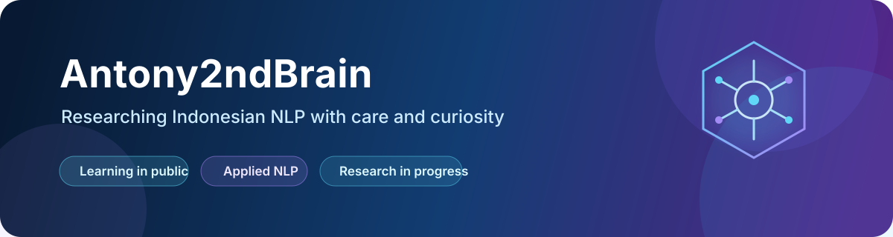

  

  
  

## Hello 👋

I am building my research skills in public and learning how to turn careful questions into reproducible work. My current focus is Indonesian natural-language processing, employee-stress classification, class imbalance, machine learning, and transformer approaches.

### Current research

> **Handling Imbalance Data in Indonesian Text-Based Employee Stress Classification With Machine Learning and Transformer Approach**

The work is at an early stage. I am currently focusing on dataset understanding, validation, research design, and responsible handling of sensitive text before beginning model development.

### What I am learning

- reproducible research workflows;
- Indonesian text preprocessing and validation;
- responsible handling of imbalanced classification data;
- classical machine-learning and transformer methodology;
- clear technical documentation for research decisions.

## Let us communicate

Questions, constructive feedback, and research conversations are welcome.

- **Start a conversation:** [Open a GitHub Discussion](https://github.com/Antony2ndBrain/Antony2ndBrain/discussions)
- **Report a profile problem:** [Open an issue](https://github.com/Antony2ndBrain/Antony2ndBrain/issues/new)
- **Follow future work:** [Follow this GitHub profile](https://github.com/Antony2ndBrain?tab=followers)

When contacting me publicly, please do not share private employee data, raw research data, passwords, access tokens, or other sensitive information.

---

  Learning carefully, documenting honestly, and improving one research step at a time.

